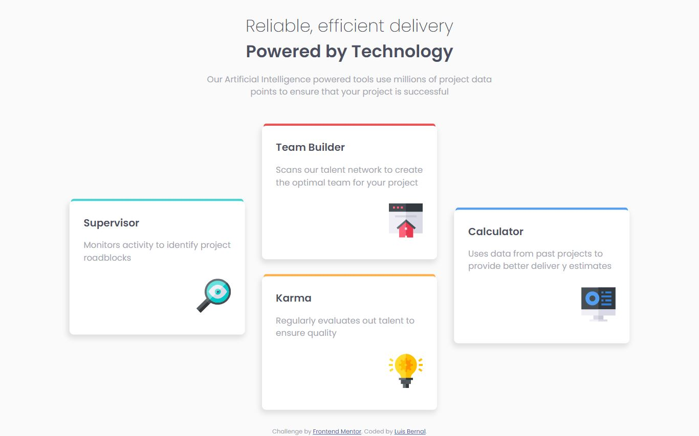

# Frontend Mentor - Four card feature section solution

This is a solution to the [Four card feature section challenge on Frontend Mentor](https://www.frontendmentor.io/challenges/four-card-feature-section-weK1eFYK). Frontend Mentor challenges help you improve your coding skills by building realistic projects.

## Table of contents

- [Overview](#overview)
  - [The challenge](#the-challenge)
  - [Screenshot](#screenshot)
  - [Links](#links)
- [My process](#my-process)
  - [Built with](#built-with)
  - [What I learned](#what-i-learned)
  - [Continued development](#continued-development)

## Overview

### The challenge

Users should be able to:

- View the optimal layout for the site depending on their device's screen size

### Screenshot

### Links

- Solution URL: [https://github.com/FrontendMentor-Lecap/Four-card-feature-section]
- Live Site URL: [https://frontendmentor-lecap.github.io/Four-card-feature-section]

## My process

### Built with

- Semantic HTML5 markup
- CSS custom properties
- Flexbox
- CSS Grid

### What I learned

I learned about CSS grid and the importance of the grid-template-column and fr's. I learned how to place a section in 2 rows while still being positioned in the middle. I learned how to mix between flexbox and CSS Grid in order to have better results with a cleaner code.

I thing I learned the most was using box-shadows, to create different shadows around an object and positioning them in a correct manner.

### Continued development

I need to continue developing positionment and the combination of CSS grid strategies. I would like to improve with the minmax values in order to prevent using media queries. It is important to keep refining code, making it more accessible for other programers and simpler, in case it is necessary to edit.
